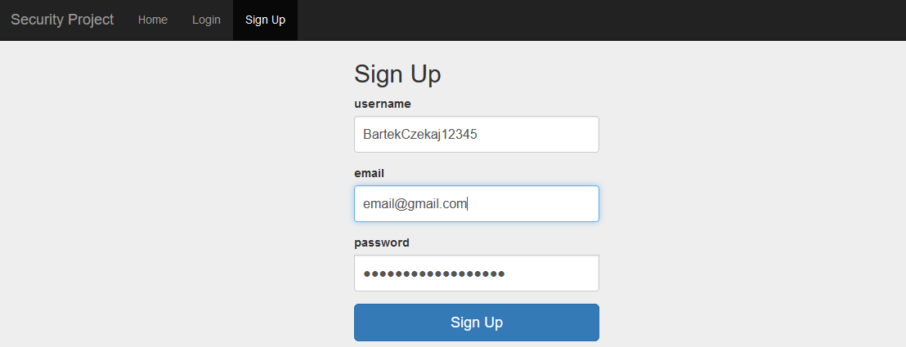
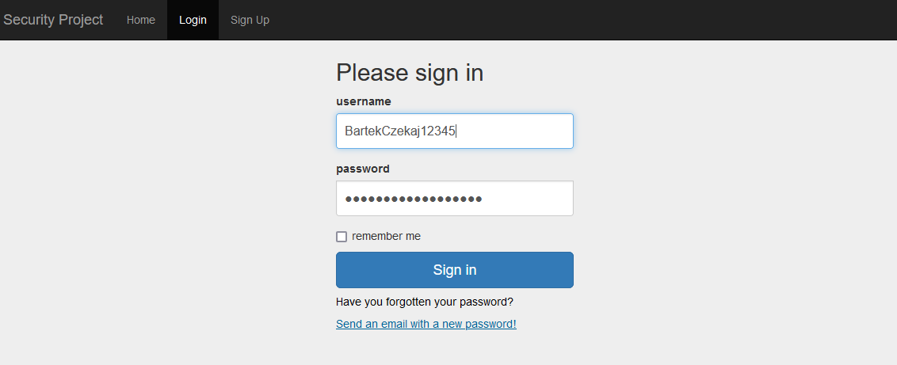
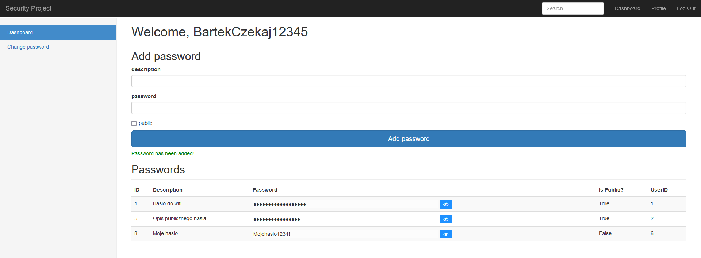
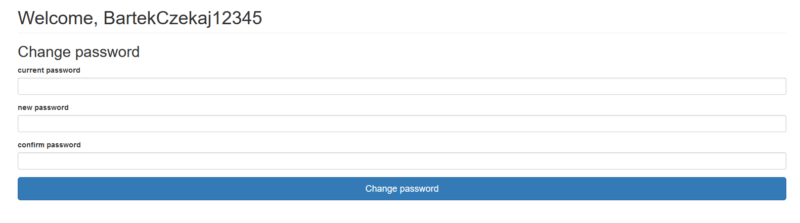

# Projekt Ochrona Danych
Projekt napisany we flask, bez części serwerowej. Aplikacja służy do przechowywania haseł.

Spis funkcjonalności:
* Walidacja danych pochodzących z formularza login-hasło
* Przechowywanie hasła chronione funkcją hash, solą i pieprzem
* Możliwość umieszczenia w bazie haseł dostępnych prywatnie lub dla określonych użytkowników
* Szyfrowanie symetryczne przechowywanych haseł
* Możliwość zmiany hasła
* Możliwość odzyskania dostępu w przypadku utraty hasła
* Wielokrotne wykorzystanie funkcji hash, żeby wydłużyć ataki brute-force na hash
* Weryfikacja liczby nieudanych prób logowania
* Dodanie opóźnienia przy weryfikacji hasła w celu wydłużenia ataków zdalnych
* Sprawdzanie jakości hasła (jego entropii)

## Rejestracja

## Logowanie

## Dashboard

## Zmiana hasła

